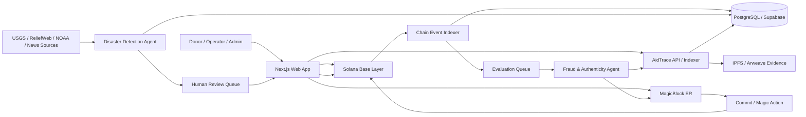
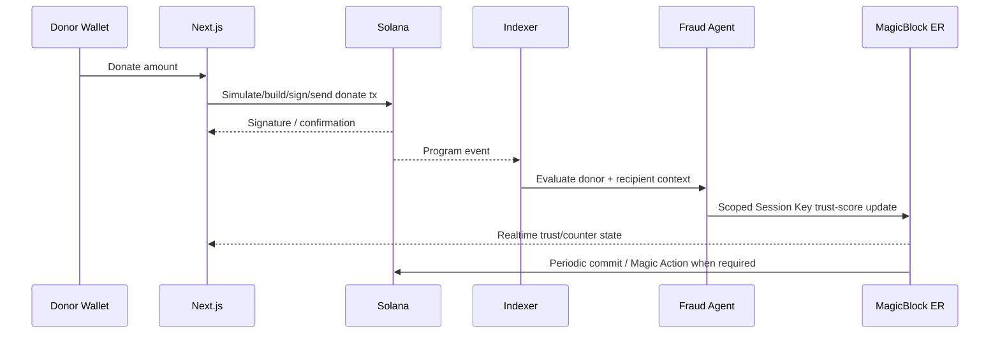
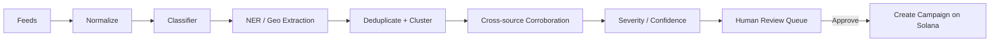

# AidTrace — System Architecture

**Status:** v1 implementation architecture  
**Companion documents:** `prd.md`, `rules.md`, `design.md`, `task.md`, `memory.md`

---

## 1. Architecture goals

AidTrace uses a three-tier trust model:

1. **Solana base layer** — permanent financial and governance truth.
2. **MagicBlock Ephemeral Rollup** — delegated, low-latency intermediate state.
3. **Off-chain services** — AI computation, external data ingestion, indexing, search, evidence metadata, and orchestration.

The architecture must make it impossible to confuse these roles.

---

## 2. Skill-guided implementation decisions

The original project brief names `@solana/wallet-adapter`. The current Solana development skill recommends the modern Solana Kit stack for new development. For AidTrace v1:

- use **Anchor 1.1.x** for the program;
- use **`@solana/kit`** for new TypeScript Solana client code;
- use **Wallet Standard via `@solana/kit-plugin-wallet` / current Solana React integration** for wallet connection;
- use **Codama-generated clients** from the program IDL where practical;
- use **LiteSVM/Mollusk for fast program-level tests** and **Surfpool for integration flows** where its environment fits;
- isolate any legacy `@solana/web3.js` or wallet-adapter usage behind adapters only when a third-party dependency requires it.

For MagicBlock:

- use the **dual-connection model**: one base-layer Solana connection and one ER/router connection;
- explicitly model **delegation -> ER mutation -> commit -> undelegate/recovery** lifecycles;
- use **Session Keys** for narrowly scoped automated backend authority;
- use **Magic Actions** only for base-layer follow-up instructions that logically belong with an ER commit;
- treat commit sponsorship, delegated-account lamport requirements, and ER endpoint selection as first-class operational concerns.

---

## 3. High-level component diagram



---

## 4. Repository structure

```text
aidtrace/
├─ app/                         # Next.js 16 App Router
│  ├─ app/
│  │  ├─ (public)/
│  │  ├─ dashboard/
│  │  ├─ admin/
│  │  └─ api/                  # thin web-facing endpoints only
│  ├─ components/
│  ├─ features/
│  │  ├─ campaigns/
│  │  ├─ donations/
│  │  ├─ disbursements/
│  │  ├─ trust/
│  │  ├─ disaster-review/
│  │  └─ roundup/
│  └─ lib/
│     ├─ solana/
│     ├─ magicblock/
│     ├─ api/
│     └─ generated/            # Codama-generated program client
├─ programs/
│  └─ aidtrace/
│     └─ src/
│        ├─ lib.rs
│        ├─ state/
│        ├─ instructions/
│        ├─ errors.rs
│        ├─ events.rs
│        └─ constants.rs
├─ ai-service/
│  ├─ src/
│  │  ├─ fraud/
│  │  ├─ disaster/
│  │  ├─ features/
│  │  ├─ models/
│  │  ├─ feeds/
│  │  ├─ jobs/
│  │  ├─ chain/
│  │  └─ api/
│  ├─ tests/
│  └─ models/                  # versioned local artifacts/metadata
├─ indexer/
├─ packages/
│  ├─ shared-types/
│  ├─ validation/
│  └─ config/
├─ tests/
│  ├─ program/
│  ├─ integration/
│  └─ e2e/
├─ scripts/
│  ├─ devnet/
│  ├─ demo/
│  └─ seed/
├─ docs/
│  ├─ prd.md
│  ├─ architecture.md
│  ├─ rules.md
│  ├─ design.md
│  ├─ task.md
│  └─ memory.md
├─ Anchor.toml
├─ Cargo.toml
├─ package.json
└─ README.md
```

---

## 5. Solana program architecture

### 5.1 Account model

#### GlobalConfig PDA

Suggested seeds: `['config']`

Fields:

- admin authority
- treasury/config authority
- protocol version
- fraud threshold
- paused flag
- bump

#### Organization PDA

Suggested seeds: `['org', authority]` or `['org', organization_id]`

Fields:

- authority
- metadata hash/CID digest
- status
- aggregate verified-delivery count
- bump

#### Campaign PDA

Suggested seeds: `['campaign', organization, campaign_id]`

Fields:

- organization
- authority
- campaign id
- target amount
- canonical amount raised
- canonical amount disbursed
- status
- created_at
- ends_at optional
- evidence hash
- funding counter PDA
- bump

#### TrustScore PDA

Suggested seeds: `['trust', subject_pubkey]`

Fields:

- subject
- score `u8` or fixed normalized representation
- risk band
- model version hash/id
- evaluated_at
- canonical sequence/version
- flagged bool
- bump

This is the primary account delegated to the ER for frequent updates.

#### FraudFlag PDA

Suggested seeds: `['fraud_flag', subject_pubkey]`

Fields:

- subject
- severity
- triggering score
- reason/evidence hash
- created_at
- resolution status
- bump

FraudFlag is durable Solana state. It is not ER-only.

#### FundingCounter PDA

Suggested seeds: `['funding_counter', campaign]`

Fields:

- campaign
- realtime aggregate
- last canonical amount
- last sequence
- last commit timestamp
- bump

This is delegated during surge windows.

#### Allocation / Disbursement / Verification

Use separate PDAs where history needs direct addressability. For very high-volume immutable donation history, prefer event indexing plus minimal canonical aggregate state unless the product needs one account per donation.

### 5.2 Program instruction surface

Initial instruction set:

```text
initialize_config
register_organization
create_campaign
activate_campaign
pause_campaign
close_campaign

donate
create_allocation
record_disbursement
verify_delivery
raise_dispute

initialize_trust_score
delegate_trust_score
update_trust_score
commit_trust_score
undelegate_trust_score

initialize_funding_counter
delegate_funding_counter
update_funding_counter
commit_funding_counter
undelegate_funding_counter

resolve_fraud_flag
```

MagicBlock-specific macros/helpers must be applied only after checking the exact current SDK API. Do not cargo-code from memory.

---

## 6. Financial invariants

These invariants are more important than UI behavior:

```text
campaign.amount_disbursed <= campaign.amount_raised
allocation.spent <= allocation.amount
no donation succeeds without corresponding value transfer
no disbursement succeeds without authorized signer + sufficient available balance
ER FundingCounter is never authoritative for custody
AI service can never sign treasury transfers
closed campaigns cannot accept normal donations unless explicitly reopened by authority
```

All arithmetic must use checked operations and integer token units.

---

## 7. Donation transaction flow



Important: donation completion does not depend on the AI evaluation succeeding.

---

## 8. MagicBlock architecture

### 8.1 Connections

Frontend/backend clients that need both domains should never reuse one RPC variable ambiguously.

```text
baseConnection / baseClient -> Solana Devnet
rollupConnection / erClient -> MagicBlock router / target ER
```

Code must make the destination explicit at every state-changing call.

### 8.2 TrustScore lifecycle

```text
Create canonical TrustScore on Solana
    -> Delegate account to ER
    -> AI evaluates transaction off-chain
    -> AI service writes score using scoped Session Key
    -> If threshold crossed, schedule Magic Action for durable flag
    -> Commit on cadence / critical transition
    -> Undelegate at review/campaign lifecycle end
```

### 8.3 FundingCounter lifecycle

```text
Campaign approved on Solana
    -> Initialize canonical FundingCounter
    -> Delegate FundingCounter to ER
    -> Confirm donation on base layer
    -> Relayer increments/reconciles ER counter
    -> UI renders realtime aggregate
    -> Periodic commit to Solana
    -> Final reconcile + undelegate when surge window/campaign ends
```

### 8.4 Reconciliation rule

Let:

- `C` = canonical Solana amount raised
- `R` = ER realtime funding counter

The UI may present `R` as realtime only when its provenance/sequence is valid. Canonical audit views always use `C`.

If `R != C` beyond the configured lag window, show a `reconciling` state and trigger a reconciliation job. Never mutate financial history to force a cosmetic match.

### 8.5 Session Key policy

Session Key permissions should be scoped by:

- program ID
- allowed instruction discriminator(s)
- target account(s) or account class where supported
- expiration
- transaction/usage limits where supported

Session Keys must not grant `donate`, treasury transfer, disbursement, admin, campaign activation, or fraud-resolution authority.

### 8.6 Failure and recovery

MagicBlock failure modes to design for:

- delegated account routed to wrong endpoint
- stale base-layer read while delegated
- account not funded for required ER operations/commit
- expired Session Key
- commit limit / sponsorship configuration issue
- failed Magic Action follow-up
- commit succeeds but UI indexer lags
- abandoned delegation

Every delegated account needs observable lifecycle state and an admin-safe recovery/undelegation path.

---

## 9. Fraud Agent architecture

### 9.1 Pipeline

```text
transaction event
 -> entity lookup
 -> feature extraction
 -> graph update
 -> rules
 -> statistical/anomaly model
 -> score aggregation
 -> explanation object
 -> persist evaluation
 -> permitted ER write
```

### 9.2 Model strategy

For hackathon v1, prefer interpretable components:

- deterministic rules for hard signals
- graph features with NetworkX
- Isolation Forest / Local Outlier Factor or similar anomaly detector for numeric behavior
- text/entity similarity only where registry/news matching benefits from it
- weighted score aggregation with versioned weights

Do not train a complex model merely to claim “AI.” The demo should make the reasoning visible.

### 9.3 Suggested evaluation schema

```json
{
  "evaluation_id": "uuid",
  "subject": "solana_pubkey",
  "subject_type": "donor|organization|recipient|vendor",
  "score": 74,
  "risk_band": "medium",
  "model_version": "fraud-v1.0.0",
  "features": {},
  "reasons": [],
  "evidence_refs": [],
  "created_at": "timestamp"
}
```

---

## 10. Disaster Agent architecture

### 10.1 Data adapters

Each source has an adapter that yields a shared normalized event:

```text
source
source_event_id
published_at
observed_at
title
body/summary
url/reference
lat/lon if available
location text
category hints
raw payload pointer
```

### 10.2 Pipeline



### 10.3 Human gate

The API contract should make approval explicit:

```text
POST /admin/disaster-candidates/:id/approve
```

Only this human-authenticated route may initiate campaign creation. The detector itself writes candidates only.

---

## 11. Off-chain database

Suggested tables:

- `organizations`
- `campaigns_projection`
- `chain_transactions`
- `donations_projection`
- `disbursements_projection`
- `delivery_evidence`
- `trust_evaluations`
- `fraud_features`
- `disaster_feed_items`
- `disaster_clusters`
- `disaster_candidates`
- `review_actions`
- `er_account_state`
- `reconciliation_jobs`
- `job_runs`

Postgres is a query/projection layer, not the authoritative ledger for money movement.

---

## 12. API boundaries

Suggested service surface:

```text
GET  /campaigns
GET  /campaigns/:pubkey
GET  /campaigns/:pubkey/audit
GET  /organizations/:pubkey/trust
GET  /transactions/:signature

POST /internal/fraud/evaluate
POST /internal/er/trust-update
POST /internal/er/counter-reconcile

GET  /admin/disaster-candidates
POST /admin/disaster-candidates/:id/approve
POST /admin/disaster-candidates/:id/reject
```

Write paths touching Solana should return transaction/instruction material for user signing unless the authorized backend is intentionally the signer for a non-custodial system action.

---

## 13. Indexing strategy

Emit structured Anchor events for major transitions:

- `CampaignCreated`
- `CampaignStatusChanged`
- `DonationReceived`
- `AllocationCreated`
- `DisbursementRecorded`
- `DeliveryVerified`
- `TrustScoreCommitted`
- `FraudFlagRaised`
- `FraudFlagResolved`
- `FundingCounterCommitted`

Indexer should be idempotent using signature + event index as a stable key.

---

## 14. Testing architecture

### Program unit/integration

- PDA derivation
- authority failures
- arithmetic boundaries
- campaign status transitions
- double-spend/over-disbursement attempts
- replay/idempotency where applicable
- malformed account ownership
- duplicate mutable account hazards

### MagicBlock integration

- delegate successful path
- write on correct ER
- reject wrong endpoint/state
- Session Key accepted/rejected according to scope
- commit returns expected canonical state
- Magic Action creates durable fraud flag
- recovery from expired key / abandoned delegation
- counter reconciliation

### AI

- deterministic fixtures for feature extraction
- graph-pattern fixtures
- known anomaly examples
- deduplication clusters
- false-positive/negative review set
- model version serialization

### E2E

At least one deterministic script must reproduce the complete judge demo from clean seeded state.

---

## 15. Deployment topology

```text
Vercel
  -> Next.js app

Railway/Render
  -> ai-service
  -> indexer / workers

Supabase
  -> PostgreSQL

Solana Devnet
  -> aidtrace program + canonical accounts

MagicBlock dev/validation environment
  -> delegated TrustScore and FundingCounter accounts

IPFS/Arweave
  -> evidence files / metadata
```

Secrets must live in deployment secret stores, never committed `.env` files.

---

## 16. Architecture decision log

### ADR-001 — Solana is canonical

Accepted. No ER-only financial custody or final truth.

### ADR-002 — Human gate for disaster campaign activation

Accepted. AI candidate creation is automatic; public campaign activation is not.

### ADR-003 — AI backend uses scoped Session Keys only for ER writes

Accepted. No treasury signing authority.

### ADR-004 — Modern Solana Kit client stack

Accepted for new client code, with compatibility adapters only where dependencies require older APIs.

### ADR-005 — Funding counter is derived realtime state

Accepted. It must reconcile to canonical Solana donation data.
